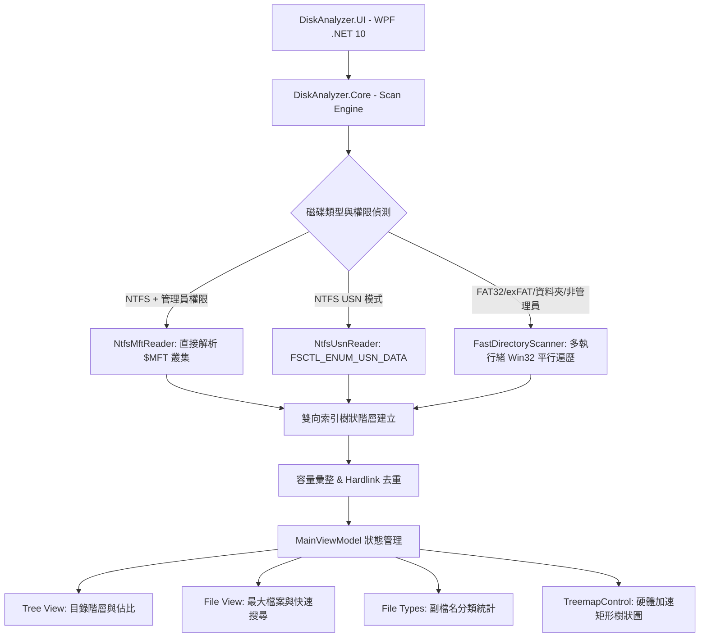

# DiskAnalyzer ⚡

> **極速硬碟空間分析與視覺化工具**  
> 直接讀取 NTFS Master File Table ($MFT) 與 USN Change Journal，繞過作業系統傳統遍歷 API，實現數百萬檔案秒級索引與即時視覺化。

---

## 🌟 核心特色 (Features)

1. **⚡ 閃電般的掃描速度 (Direct NTFS MFT & USN Journal Engine)**
   - 直接讀取磁碟底層 `$MFT` 記錄 (Record 0 -> Data Runs cluster streaming)，在幾秒內分析數百萬個檔案與資料夾。
   - 支援 USN Journal (`FSCTL_ENUM_USN_DATA`) 高速枚舉。
   - 具備多執行緒 Win32 `FindFirstFileExW` / `FIND_FIRST_EX_LARGE_FETCH` 備援機制 (適用於非 NTFS 磁區、資料夾單獨掃描、或非管理員權限)。

2. **📊 多維度資料檢視 (Multi-View Layout)**
   - **目錄樹狀圖 (Tree View)**：即時顯示資料夾階層，包含視覺化佔比長條圖 (% Bar)、邏輯大小、實際佔用大小 (Allocated Size)、檔案數量、資料夾數量、修改時間與屬性；掃描完成後會自動展開根節點的第一層，並支援 Ctrl/Shift 多選與批次操作。
   - **大檔案清單 (File View)**：虛擬化表格即時呈現硬碟中佔用最大的檔案清單，支援即時關鍵字、副檔名與萬用字元過濾。
   - **副檔名佔比分析 (File Types)**：依檔案類型 (`.mp4`, `.zip`, `.dll`, `.iso`, `.exe` 等) 彙整磁碟空間消耗與檔案總數，附精美分類配色。

3. **🗺️ 互動式樹狀矩形圖 (Interactive Squarified Treemap & 開關切換)**
   - 採用 **Bruls-Huizing-van Wijk Squarified Treemap** 演算法，將檔案依大小比例繪製為方塊。
   - 具備 3D Cushion 光澤渲染與依副檔名分類之視覺色彩。
   - 支援滑鼠 Hover 即時工具提示 (Tooltip)、點擊聯動 Tree/File View、雙擊深入 (Zoom In) 資料夾、以及麵包屑導航 (Breadcrumbs)。
   - **⚡ 自由開關與極致效能**：頂部工具列提供「🗺️ 顯示/隱藏熱力圖」切換按鈕與右鍵選單控制。關閉時會立即停止所有熱力圖計算與繪圖，並讓上方目錄樹與大檔案表格自動全螢幕延展，大幅節省記憶體與 CPU 負載！

4. **🎯 100% 精準空間計算 (Hardlink Deduplication)**
   - 精確處理 NTFS Hard Link (硬連結)，避免重複計算空間，讓統計容量與 Windows 檔案總管完全吻合。
   - 自動補足 [Free Space] 與 [Allocated/System Space] 虛擬項目。

5. **🛠️ 完整的 Windows 檔案總管右鍵選單整合**
   - 支援「開啟檔案」、「在檔案總管中顯示」、「複製完整路徑」、「複製檔案資訊」、「在此處開啟 CMD / PowerShell」、「移至資源回收筒」、「永久刪除」與「Windows 檔案內容對話框」。
   - 右鍵點擊已選取項目時會保留整批選取，可直接對多個檔案執行刪除或其他批次操作。

6. **📁 匯出與剪貼簿 (Export & Clipboard)**
   - 支援匯出為標準 CSV 格式 (`FileName,Size,Allocated,Modified,Attributes,Files,Folders`)，無縫支援 Excel、試算表與各類資料處理工具。

---

## 🖱️ Tree View 操作方式

- **單擊**：選取單一檔案或資料夾。
- **Ctrl + 單擊**：加入或取消個別項目的選取。
- **Shift + 單擊**：選取目前項目與錨點之間的範圍。
- **右鍵**：對目前選取集合開啟內容選單；若右鍵點擊已選取項目，不會清除其他選取項目。
- **雙擊檔案**：直接使用系統預設程式開啟檔案。
- **掃描完成**：根節點會自動展開，先顯示第一層資料夾與檔案。

---

## 🏗️ 系統架構 (Architecture)



---

## 🚀 專案結構

- **src/DiskAnalyzer.UI**：
  - `Core/`：
    - `Native/`：Win32 底層 P/Invoke、NTFS 結構、Process Token 提權 (`SeBackupPrivilege`)、Shell 整合。
    - `Mft/`：NTFS Data Run 解碼器、Fixup 校正、Record 0x10/0x30/0x80 解析器、USN Journal 讀取器。
    - `Scanning/`：多執行緒 Win32 遍歷器、全域掃描調度器 (`DiskScanEngine`)。
    - `Treemap/`：Squarified Treemap 演算法與色彩配置盤。
    - `Search/` & `Export/`：檔案搜尋引擎與高效能 CSV 串流匯出器。
  - `Controls/`：高效能 `TreemapControl` (自定義 `DrawingContext` 渲染)、`DriveUsageGauge` 磁碟佔用長條儀表。
  - `ViewModels/`：MVVM 架構、即時搜尋、縮放導航、非同步掃描排程。
  - `Themes/`：現代暗色主題 (Dark Theme) 樣式。
- **tests/DiskAnalyzer.Tests**：
  - 核心引擎與 UI 元件單元測試。

---

## 💻 建置與執行 (Build & Run)

### 執行環境需求
- Windows 10 / 11 / Windows Server
- .NET 10.0 執行階段 (Runtime) 或 SDK

### 快速執行
直接於專案根目錄雙擊執行：
```powershell
.\DiskAnalyzer.exe
```
*(建議使用「以系統管理員身分執行」以啟用 NTFS MFT 秒級掃描)*
