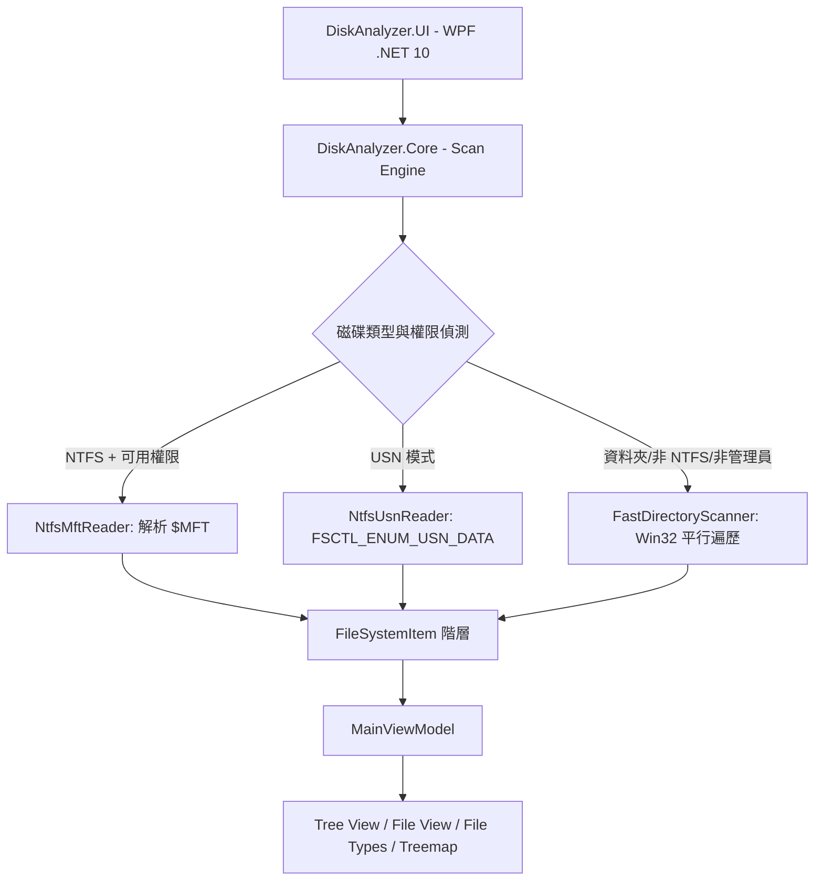

# DiskAnalyzer ⚡

> **極速 Windows 磁碟空間分析與視覺化工具**

DiskAnalyzer 是一個以 WPF 和 .NET 10 開發的 Windows x64 磁碟空間分析工具。它能使用 NTFS `$MFT`、USN Change Journal，以及 Win32 平行資料夾遍歷器建立檔案階層，並以 Tree View、File View、File Types 與互動式 Treemap 呈現結果。

## 🌐 語言 / Languages

[繁體中文](README.md) · [English](README.en.md) · [简体中文](README.zh-CN.md) · [日本語](README.ja.md) · [한국어](README.ko.md) · [Español](README.es.md) · [Français](README.fr.md)

## 📌 專案狀態

目前專案處於積極開發階段，主要支援 Windows 10/11 x64。功能與 UI 仍可能調整，歡迎透過 Issue 提供問題回報與建議。

## 🌟 核心特色

1. **⚡ 高速掃描引擎**
   - 在適用條件下直接讀取 NTFS `$MFT` 記錄與 Data Runs。
   - 支援 USN Journal (`FSCTL_ENUM_USN_DATA`) 高速枚舉。
   - 提供多執行緒 Win32 `FindFirstFileExW` / `FIND_FIRST_EX_LARGE_FETCH` 備援，適用於非 NTFS 磁區、指定資料夾或非管理員權限。

2. **📊 多種資料檢視**
   - **Tree View**：顯示目錄階層、大小、實際配置大小、檔案數、資料夾數、修改時間與屬性；支援 Ctrl/Shift 多選、右鍵批次操作，以及掃描完成後自動展開第一層。
   - **File View**：以虛擬化表格呈現大型檔案，支援關鍵字、副檔名與萬用字元過濾。
   - **File Types**：依副檔名彙整容量與檔案數量。

3. **🗺️ 互動式 Squarified Treemap**
   - 使用 Bruls-Huizing-van Wijk Squarified Treemap 演算法依檔案大小繪製方塊。
   - 支援 Hover 工具提示、Tree/File View 聯動、雙擊 Zoom In 與 Breadcrumb 導航。
   - 可隨時隱藏 Treemap，讓 Tree View 和 File View 延展並降低不必要的繪圖負載。

4. **🎯 精準容量統計**
   - 處理 NTFS Hard Link，避免重複計算同一檔案。
   - 可加入 Free Space 與 Allocated/System Space 虛擬項目。

5. **🛠️ Windows Shell 整合**
   - 支援開啟檔案、在檔案總管中顯示、複製完整路徑、複製檔案資訊、在此處開啟 CMD/PowerShell、移至資源回收筒、永久刪除，以及 Windows Properties 對話框。

6. **📁 匯出與剪貼簿**
   - 支援匯出標準 CSV：`FileName,Size,Allocated,Modified,Attributes,Files,Folders`。

7. **🌐 多國語言**
   - 主程式可即時切換 English、繁體中文、简体中文、日本語、한국어、Español 與 Français。
   - 語言選擇會保存，重新啟動後沿用。
   - Inno Setup 安裝程式同樣支援上述語言。

## 🖱️ Tree View 操作

- **單擊**：選取單一檔案或資料夾。
- **Ctrl + 單擊**：加入或取消個別項目。
- **Shift + 單擊**：選取錨點與目前項目之間的範圍。
- **右鍵**：對目前選取集合開啟內容選單；右鍵點擊已選取項目時會保留其他選取。
- **雙擊檔案**：使用 Windows 預設程式開啟。
- **掃描完成**：根節點會自動展開第一層。

## 💻 系統需求

- Windows 10、Windows 11 或相容的 Windows Server x64。
- 執行原始碼需要 .NET 10 SDK；portable 發佈版包含 .NET 執行環境。
- 管理員權限不是所有功能的必要條件，但可讓 NTFS MFT 掃描取得較完整的存取權限與較佳速度。

## 📦 安裝與執行

### Portable

從 GitHub Releases 下載 `DiskAnalyzer_Portable_win-x64.zip`，解壓縮後執行 `DiskAnalyzer.exe`。Portable 版本不需要安裝；正式公開 repository 後，建議將 portable 壓縮檔放在 Releases，而不是提交到 Git 歷史。

### Inno Setup

執行安裝程式即可選擇安裝語言、桌面捷徑與 Windows 檔案總管右鍵整合。安裝程式會使用 `DiskAnalyzer.iss` 和 portable 發佈目錄建立。

### 授權與第三方通知

Portable 與安裝版本會隨附 `LICENSE.txt` 和 `THIRD-PARTY-NOTICES.txt`。前者是 DiskAnalyzer 自有程式碼的 MIT 授權，後者列出 self-contained .NET 執行環境及測試相依套件的來源與授權連結。

## 🏗️ 系統架構



## 🚀 專案結構

```text
src/DiskAnalyzer.Core/       核心模型、掃描器、MFT/USN、匯出與搜尋
src/DiskAnalyzer.UI/         WPF 應用程式、ViewModel、控制項、主題與語系資源
tests/DiskAnalyzer.Tests/    核心與 UI 元件測試
DiskAnalyzer.iss             Inno Setup 安裝程式腳本
```

## 🔧 從原始碼建置

在 Windows、PowerShell 與 .NET 10 SDK 環境執行：

```powershell
dotnet restore DiskAnalyzer.slnx
dotnet build src/DiskAnalyzer.UI/DiskAnalyzer.UI.csproj -c Debug
dotnet test tests/DiskAnalyzer.Tests/DiskAnalyzer.Tests.csproj --no-restore
```

建立 self-contained single-file portable 版本：

```powershell
dotnet publish src/DiskAnalyzer.UI/DiskAnalyzer.UI.csproj `
  -c Release -r win-x64 --self-contained true `
  -p:PublishSingleFile=true `
  -p:IncludeNativeLibrariesForSelfExtract=true `
  -o ./publish
```

## ⚠️ 使用注意事項與限制

- 這是 Windows x64 應用程式，不以 Linux 或 macOS 為目標平台。
- 直接讀取磁碟結構可能需要管理員權限；受保護或無法存取的資料夾可能被略過。
- 掃描、刪除與永久刪除功能都會操作使用者選取的檔案，請先確認目標路徑並保留重要資料備份。
- 目前未承諾穩定的公開 API；若將核心程式碼作為函式庫使用，請預期版本升級可能包含 breaking changes。

## 🤝 貢獻

歡迎提交 Issue、功能建議與 Pull Request。請先閱讀 [CONTRIBUTING.md](CONTRIBUTING.md)，並在提交前執行測試。

若回報問題，請盡量提供 Windows 版本、執行檔版本、掃描模式、重現步驟與錯誤訊息；不要在 Issue 中貼出個人檔案路徑、機密資料或完整磁碟內容。
疑似安全性問題請先閱讀 [SECURITY.md](SECURITY.md)，不要直接公開完整漏洞細節。

## 📄 授權

本專案採用 [MIT License](LICENSE)。MIT 是寬鬆型授權，允許使用、修改、散布與商業使用，但散布時需保留版權與授權聲明；軟體依「現狀」提供，不附帶保固。

Copyright © 2026 Alex Lin.
